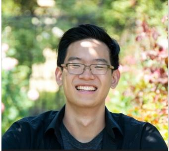
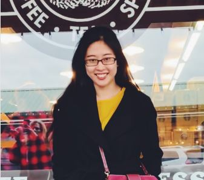
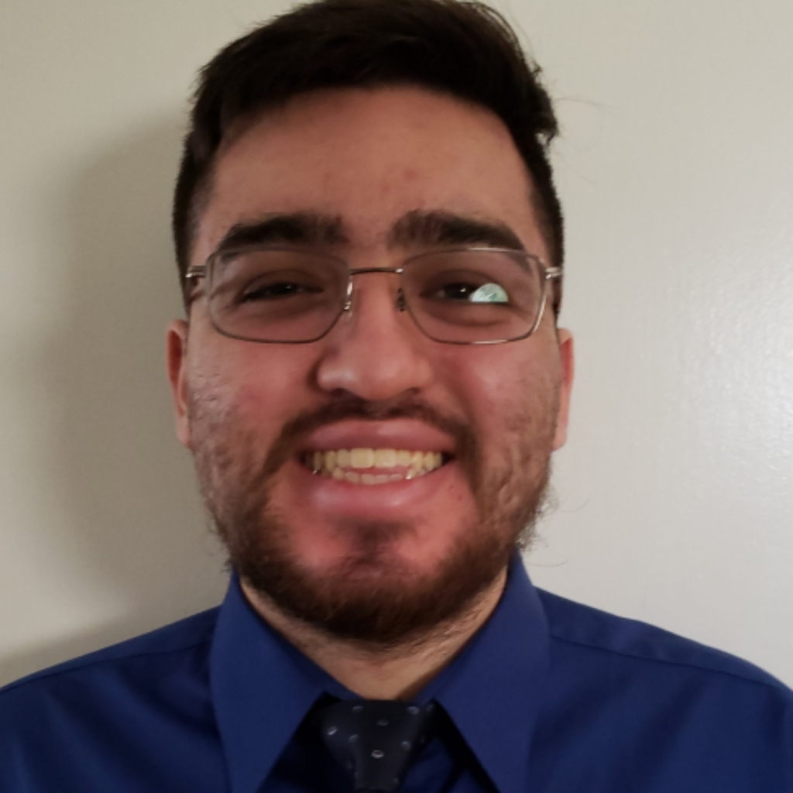

<ul class="navbar">
  <li><a class="links" href="/Website/#contact-information">Contact Information</a></li>
  <li><a class="links" href="/Website/#meet-the-team">Meet the Team</a></li>
  <li><a class="links" href="/Website/#important-links">Important Links</a></li>
  <li><a class="links" href="/Website/#mission">Mission</a></li>
  <li><a class="links" href="/Website/#mlsjsu">Title</a></li>
</ul>
 
# ML@SJSU

---

## Mission

 * To promote machine learning growth at SJSU.  
 * To enhance students with career-enabling skills.  
 * To connect students with a common interest in  machine learning who wish to collaborate.  
 * To promote diversity in machine learning.  
---

## Important links

[Sign up for ML@SJSU](https://docs.google.com/forms/d/e/1FAIpQLSePkD5O-81AGgtwxGZSegI2_rq0Ic5o7R9KgyOplnd-yCxa9Q/viewform)

---

## Meet the team

<table>
  <tr>
    <td>   <h3 align="center">Andrew Jong</h3> 
President
</td>
    <td>   <h3 align="center">Jing Zhao</h3> 
Vice President
</td>
    <td>   <h3 align="center">Gaston Garrido </h3> 
 Webmaster 
</td>
  </tr>
  <tr>
    <td>   <h3 align="center">Jason Jiang </h3> 
 Officer 
</td>
    <td>Jackson</td>
    <td>94</td>
  </tr>
</table>    

  
---

## Contact Information

* Club: 		    `sjsumlclub@gmail.com`
* President:    `andrew.jong@sjsu.edu`
* VP: 				`jing.zhao@sjsu.edu`

---
